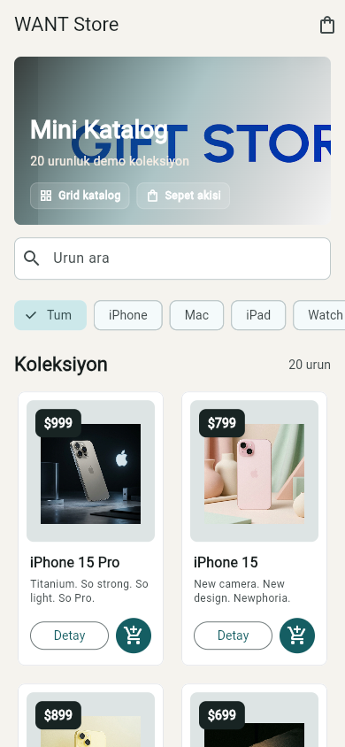
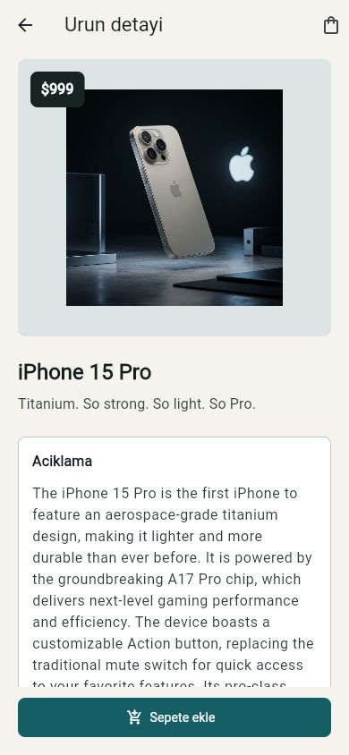
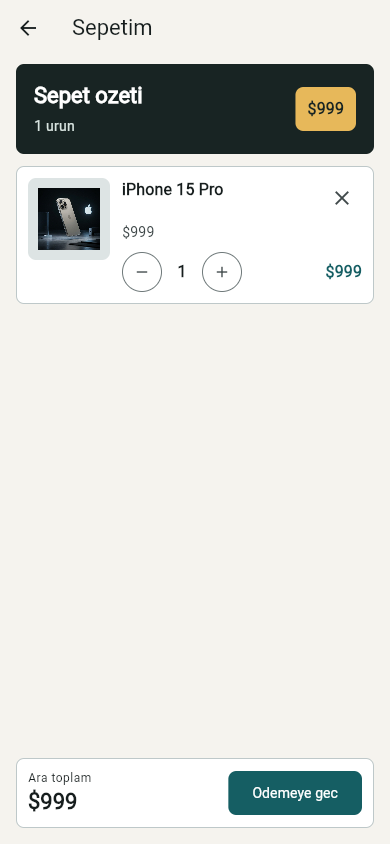
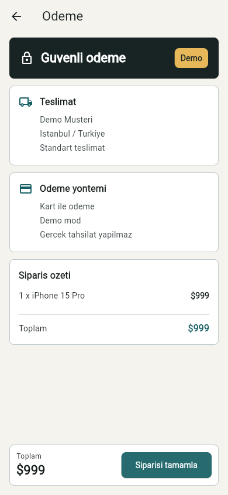

# Mini Katalog Uygulamasi

Flutter egitimi icin hazirlanmis temel seviye mini katalog uygulamasi.

## Ozellikler

- Ana sayfada banner ve urun listesi
- `GridView` tabanli urun kartlari
- Urun arama ve filtreleme
- Urun detay sayfasi
- Sepet sayfasi, adet arttirma/azaltma ve kaldirma
- Demo odeme sayfasi
- `Navigator.pushNamed` ve route argument kullanimi
- Yerel JSON verisi ile `fromJson` / `toJson` model ornegi
- Basit sepet state guncellemesi
- Yerel asset yonetimi: banner, urun gorselleri ve JSON dosyasi

## Kullanilan Flutter Surumu

```text
Flutter 3.44.0
Dart 3.12.0
```

## Calistirma

```bash
flutter pub get
flutter run
```

Android cihaz veya emulator secmek icin:

```bash
flutter devices
flutter run -d <device-id>
```

Web uzerinden kontrol etmek icin:

```bash
flutter run -d chrome
```

## Test

```bash
flutter analyze
flutter test
```

## Veri Kaynagi

Demo urun verisi egitim amacli olarak `https://wantapi.com/products.php`
adresinden alinip yerel `assets/data/products.json` dosyasina kaydedildi.
Uygulama calisirken ek HTTP paketi kullanmaz.

## Ekran Goruntuleri





